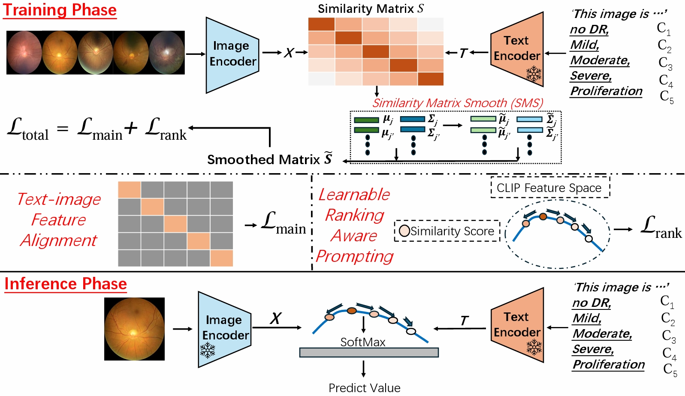

# CLRP-DR
This repository contains PyTorch implementation of "CLIP-DR: Textual Knowledge-Guided Diabetic Retinopathy Grading with Ranking-aware Prompting".
## Introduction
Diabetic retinopathy (DR) is a complication of diabetes and usually takes decades to reach sight-threatening levels. Accurate and robust detection of DR severity is critical for the timely management and treatment of diabetes. However, most current DR grading methods suffer from insufficient robustness to data variability (e.g. colour fundus images), posing a significant difficulty for accurate and robust grading. In this work, we propose a novel DR grading framework CLIP-DR based on three observations: 1) Recent pre-trained visual language models, such as CLIP, showcase a notable capacity for generalisation across various downstream tasks, serving as effective baseline models. 2) The grading of image-text pairs for DR often adheres to a discernible natural sequence, yet most existing DR grading methods have primarily overlooked this aspect. 3) A long-tailed distribution among DR severity levels complicates the grading process. This work proposes a novel ranking-aware prompting strategy to help the CLIP model exploit the ordinal information. Specifically, we sequentially design learnable prompts between neighbouring text-image pairs in two different ranking directions. Additionally, we introduce a Similarity Matrix Smooth module into the structure of CLIP to balance the class distribution. Finally, we perform extensive comparisons with several state-of-the-art methods on the GDRBench benchmark, demonstrating our CLIP-DR's robustness and superior performance.

<p align="center">
  
</p>

## Prerequisite  

### Dataset
Data can be obtained from [here](./GDRBench/README.md).

Your dataset should be organized as: 

target_DATA(need change)_train should include all images path and label. Adjust according to different targets of your DG test.

```
.
├── images
│   ├── DATASET
│   │   ├── mild_npdr
│   │   ├── moderate_npdr
│   │   ├── nodr
│   │   ├── pdr
│   │   └── severe_npdr
│   ├── DATASET2
│   │   ├── mild_npdr
│   │   ├── moderate_npdr
│   │   ├── nodr
│   │   ├── pdr
│   │   └── severe_npdr
│   ├── DATASET3
│   │    ...
│   ...  ...
│  
│   
└── splits
    ├── target_DATA(need change)_train.txt
    ├── DATA(need change)_crossval.txt
    ...

```
## Train
```
The training code will be released after the accept of the manuscript.
```
### Checkpoint
```
https://drive.google.com/drive/folders/1kNrdaGYOz2Z4BGUtN3PKR7TSECP41RK6?usp=drive_link
```
## Test
```bash
python run_test.py --config default3.yaml
```


